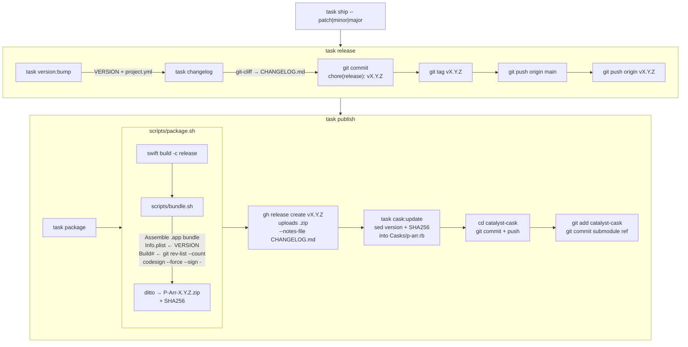

# Release Process

P-Arr is distributed as a macOS app via Homebrew cask. This document covers the full release lifecycle.

## Prerequisites

- [Homebrew](https://brew.sh) installed
- [GitHub CLI](https://cli.github.com) (`gh`) installed and authenticated
- [go-task](https://taskfile.dev) installed
- [git-cliff](https://git-cliff.org) installed (for changelog generation)
- Push access to `TheBranchDriftCatalyst/pr-widget` and `TheBranchDriftCatalyst/catalyst-cask`
- The `catalyst-cask` submodule initialized (`task cask:setup`)

## Fire and Forget

One command does everything — bump, changelog, commit, tag, push, build, GitHub release, Homebrew update:

```bash
task ship -- patch    # bugfix
task ship -- minor    # new feature
task ship -- major    # breaking change

# Shorthands:
task ship:patch
task ship:minor
task ship:major
```

## Release Flow



## Step-by-Step (if running manually)

### 1. Commit your code changes

Ensure all feature/fix commits are on `main` with conventional commit messages:

```bash
git add <files>
git commit -m "feat: add self-update via Settings"
```

Conventional commit prefixes: `feat:`, `fix:`, `chore:`, `docs:`, `refactor:`, `test:`, `perf:`

### 2. Cut the release

```bash
task release:patch    # or release:minor / release:major
```

This does:
1. **Bumps VERSION** — increments the version in `VERSION` and `project.yml` (`MARKETING_VERSION`)
2. **Generates CHANGELOG.md** — runs `git-cliff` to produce a changelog from conventional commits
3. **Commits and tags** — creates a `chore(release): vX.Y.Z` commit and a `vX.Y.Z` git tag
4. **Pushes** — pushes commit and tag to `origin/main`

### 3. Publish to GitHub + Homebrew

```bash
task publish
```

This does:
1. **Builds release** — `swift build -c release` (optimized)
2. **Bundles .app** — `scripts/bundle.sh` assembles Info.plist (version from `VERSION`, build# from git commit count), copies resources, ad-hoc codesigns
3. **Packages .zip** — `scripts/package.sh` uses `ditto` to create versioned zip + SHA256
4. **GitHub release** — `gh release create` uploads zip with CHANGELOG.md as release notes
5. **Homebrew cask** — Updates `catalyst-cask/Casks/p-arr.rb` with new version + SHA256, commits and pushes submodule
6. **Submodule ref** — Updates the submodule pointer in the parent repo

## Scripts

| Script | Purpose |
|--------|---------|
| `scripts/bundle.sh` | Assembles `.app` from build output. Generates `Info.plist` from `VERSION` file, copies resources + CHANGELOG.md, ad-hoc codesigns. Accepts `BUILD_DIR` env var (debug or release). |
| `scripts/package.sh` | Runs release build → bundle → creates versioned `.zip` via `ditto` (preserves code signatures). Outputs SHA256. |

## Version Files

| File | Field | Updated by |
|------|-------|------------|
| `VERSION` | Plain text version (single source of truth) | `task version:bump` |
| `project.yml` | `MARKETING_VERSION` | `task version:bump` |
| `catalyst-cask/Casks/p-arr.rb` | `version` + `sha256` | `task cask:update` (called by `publish`) |

## Task Reference

| Task | Description |
|------|-------------|
| `task ship -- patch\|minor\|major` | **Fire-and-forget** — release + publish in one shot |
| `task ship:patch` | Shorthand for `task ship -- patch` |
| `task ship:minor` | Shorthand for `task ship -- minor` |
| `task ship:major` | Shorthand for `task ship -- major` |
| `task release -- patch\|minor\|major` | Bump + changelog + commit + tag + push |
| `task release:patch` | Shorthand for `task release -- patch` |
| `task publish` | Build + package + GitHub release + Homebrew cask |
| `task package` | Build release + bundle .app + create .zip |
| `task version:bump -- patch\|minor\|major` | Bump version in VERSION + project.yml |
| `task changelog` | Regenerate CHANGELOG.md via git-cliff |
| `task cask:update` | Update cask formula with current version/SHA |
| `task cask:setup` | Initialize the catalyst-cask submodule |

## Homebrew Tap

P-Arr is distributed via a custom Homebrew tap:

```bash
brew tap TheBranchDriftCatalyst/catalyst
brew install --cask p-arr
```

The tap lives in the `catalyst-cask/` submodule (pointing to `TheBranchDriftCatalyst/catalyst-cask`). The `task publish` command handles updating it automatically.

Users update with:

```bash
brew upgrade --cask p-arr
```

## Troubleshooting

**`gh` not authenticated:**
```bash
gh auth login
```

**Submodule not initialized:**
```bash
task cask:setup
```

**Package step fails with signing error:**
The app uses ad-hoc signing (`CODE_SIGN_IDENTITY: "-"`). No Apple Developer account needed.

**SHA256 mismatch after publish:**
Re-run `task cask:update` — it computes the SHA from the local zip. Make sure you haven't rebuilt after uploading.
